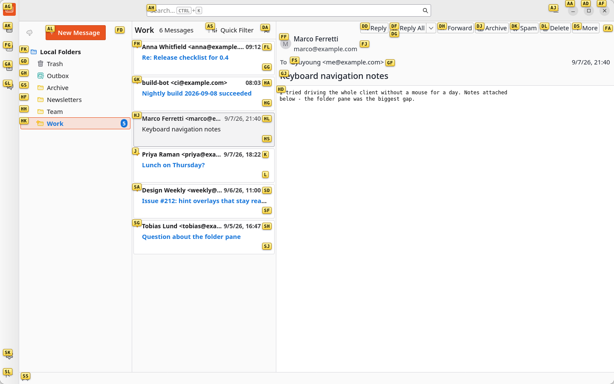

# Vimbird

Vimium-style keyboard hints for Thunderbird.

Press `f`, and every clickable thing on screen gets a short letter label. Type the label and that element is clicked — no mouse, no tabbing through the UI. Press `Esc` to cancel.



*After pressing `f`: typing `j` opens Priya's message, `dj` archives the one on screen, `al` starts a new message.*

---

## 1. Introduction

Vimbird brings Vimium's hint mode to Thunderbird's own interface — not to web pages inside it. As the screenshot above shows, labels land on the unified toolbar, the spaces and tab bars, the menu bar, folder rows, message list rows and the buttons in a message's header. The compose window gets hints of its own.

Element IDs are never hardcoded. Candidates are found by tag name, ARIA role and the `is=` attribute of Thunderbird's custom elements, so the engine keeps working when Thunderbird rearranges its widgets. All Thunderbird-specific knowledge lives in one file, [`src/tb/targets.js`](src/tb/targets.js).

**Status: MVP.** Hint mode works and is covered by 40 unit tests plus 13 end-to-end scenarios run against a real Thunderbird 155. Not implemented yet: hints for links inside message bodies, the rest of the Vim key set (`j/k`, `gg/G`, `o`, `r`, `a`, `x`, `d`, `/`), a preferences UI, and hints inside native menu popups.

**Why this needs an Experiment API**

Thunderbird's standard WebExtension APIs cannot express this add-on. Two things block it outright:

1. **A single-key `f` shortcut cannot be registered.** The `commands` API validator (`ShortcutUtils.validate`) only allows modifier-free shortcuts for F1–F12 and media keys. The request to lift this ([Bugzilla 1591730](https://bugzilla.mozilla.org/show_bug.cgi?id=1591730)) has been open since 2019.
2. **Chrome UI DOM is out of reach.** `about:3pane` and friends are privileged documents that `content_scripts` cannot target, and no `messenger.*` API hands back live toolbar or tree nodes.

So Vimbird ships one thin Experiment API for window attachment, key capture and script injection, and keeps the hint engine itself in plain modules that know nothing about Experiments. The reasoning is in [`docs/research.md`](docs/research.md), the structure in [`docs/design.md`](docs/design.md), and everything that was measured against a running Thunderbird in [`docs/verification.md`](docs/verification.md).

> Because it uses an Experiment API, Thunderbird shows a "full access to Thunderbird and your computer" prompt at install time. That warning is inherent to Experiments; Vimbird makes no network requests of its own.

---

## 2. Installation

### Temporary install (recommended)

Best for now: it survives edits without a restart, and it stays permitted even if Thunderbird tightens its Experiment policy (temporarily installed add-ons are explicitly exempt).

1. **Tools → Developer Tools → Debug Add-ons** (or open `about:debugging`)
2. **This Thunderbird** → **Load Temporary Add-on**
3. Pick `manifest.json` in this repository

The add-on disappears when Thunderbird restarts; repeat the three steps, or press **Reload** after changing the code.

### Install as an XPI

Download the `.xpi` from the [latest release](../../releases/latest), then **Add-ons Manager → gear icon → Install Add-on From File** and choose it. To build one from source instead:

```bash
npm run build      # writes dist/vimbird-<version>.xpi
```

This survives restarts, but the file is unsigned, so some Thunderbird builds and channels will refuse it. If that happens, use the temporary install above. There is no automatic update either — watch the repository's releases to hear about new versions.

Vimbird is not on [addons.thunderbird.net](https://addons.thunderbird.net). Thunderbird has paused reviews of new add-ons that use Experiment APIs until at least the 2027 ESR, and Vimbird cannot work without one (see [Introduction](#1-introduction)), so releases here are the way to get it.

**Requirements:** Thunderbird 128 or newer (developed and verified on 155). Building needs Node.js 20+; there are no runtime or build dependencies beyond the standard library.

---

## 3. Usage

### Keys

| Key | Action |
|---|---|
| `f` | Show hints for everything clickable and visible |
| `asdfghjkl` `qwertyuiop` | Type a hint label; the element is clicked as soon as the label is complete |
| `Backspace` | Undo the last typed character |
| `Esc` | Cancel hint mode |
| Any other key | Cancels hint mode (so a mistyped hint cannot trigger a command) |
| `Ctrl`/`Alt`/`Cmd` combos | Cancel hint mode and pass through to Thunderbird |

### How it behaves

- **Hints are global.** Labels are unique across the whole window, including the toolbar, the 3-pane and the open message, and they are assigned top-to-bottom, left-to-right, so items near the top get the shortest labels.
- **One or two keystrokes, never three.** The hint alphabet is the home row plus the row above it, which covers 361 elements in two characters; a maximised window with a dozen folders and a full message list measures around eighty hints. The single-character labels go to the elements nearest the top of the window, and the letters are handed out in order of comfort, so `q` and `p` only turn up when the screen is busy.
- **Labels are prefix-free.** No label is a prefix of another, so a completed label is never ambiguous: typing `s` when both `sa` and `sd` exist just narrows the choices; the typed part dims and the rest stays highlighted.
- **Only what you can see gets a hint.** Off-screen, hidden, disabled and covered elements are skipped. The message list is virtualised, so only the rows currently rendered are candidates.
- **Typing is never stolen.** With focus in a text field — subject line, message body, search box — `f` types an `f` and no hints appear.
- **Crowded areas stay readable.** Labels are drawn on each element's corner, and any that would cover each other — inline links, narrow toolbar buttons, a header full of recipients — move to the nearest free spot next to their element.
- **Hints dismiss themselves** on scroll, window resize or a mouse click, rather than leaving labels floating over the wrong elements.
- **`f` does not leak** into Thunderbird while hint mode is active, so it will not trigger folder type-ahead or other shortcuts.

### Troubleshooting

Open **Tools → Developer Tools → Browser Toolbox** and look for messages prefixed `Vimbird:`.

To see what the engine considers clickable right now, run this in the add-on's background console (Debug Add-ons → Inspect):

```js
await messenger.vimbird.dumpCandidates();   // per-document counts and tag breakdown
await messenger.vimbird.getStatus();        // which windows Vimbird is attached to
```

If a button gets no hint, `dumpCandidates()` shows whether it was missed during collection; the selectors to adjust are in [`src/tb/targets.js`](src/tb/targets.js).

---

## 4. Reporting issues

Found a button that gets no hint, a hint that clicks the wrong thing, or hint mode swallowing a key it should not? Please [open an issue](../../issues) on this project's GitHub repository.

What helps most in a report:

- Your Thunderbird version (**Help → About Thunderbird**) and operating system
- Which part of the UI it happened in — toolbar, folder tree, message list, message header, compose window
- What you pressed and what happened instead of what you expected
- Anything prefixed `Vimbird:` from **Tools → Developer Tools → Browser Toolbox**, plus the output of `await messenger.vimbird.dumpCandidates()` when an element is missing a hint

Thunderbird changes its interface between releases, so reports that name the version and the pane are usually enough to pin a problem down quickly.

---

## 5. Compatibility

- Verified on **Thunderbird 155.0** (Linux, snap package).
- `strict_min_version` is 128.0, the floor where MV3 and the current UI structure hold, but versions 128–154 have not been tested.
- Thunderbird has discussed restricting Experiment-based add-ons on the monthly release channel and postponed it by a year; ESR is not affected. Vimbird works on 155 today, and temporary installs stay exempt even if the restriction lands. Details in [`docs/research.md`](docs/research.md) §4.2.

---

## 6. License

[Mozilla Public License 2.0](LICENSE), the same licence Thunderbird itself uses.
