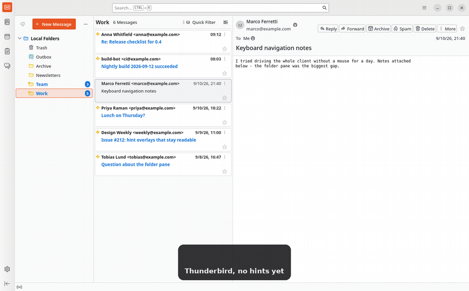

# Vimbird

Vimium-style keyboard hints for Thunderbird.

Press `f`, and every clickable thing on screen gets a short letter label. Type the label and that element is clicked — no mouse, no tabbing. `Esc` cancels.



*Recorded on Thunderbird 155: `f` labels the toolbar, folder tree, message list and message header at once; `sd` switches to the Team folder; `f` then `r` opens a message.*

## Install

1. Download `vimbird-<version>.xpi` from the [latest release](../../releases/latest). In your browser, right-click the link and choose **Save Link As…**.
2. Open **Add-ons and Themes** — the **☰** button at the top right, or **Tools → Add-ons and Themes** on macOS.
3. **Gear icon → Install Add-on From File…**, pick the file, and confirm.

Thunderbird does not require add-ons to be signed, so that one prompt is all there is. It warns about "full access to Thunderbird and your computer" because Vimbird needs an [Experiment API](#why-an-experiment-api); it makes no network requests of its own.

Needs Thunderbird 128 or newer (verified on 155). There are no automatic updates — install a newer XPI the same way.

To work on the code instead: **Tools → Developer Tools → Debug Add-ons → Load Temporary Add-on**, and pick `manifest.json`. `npm run build` packs an XPI, `npm test` and `npm run test:e2e` run the tests.

## Keys

| Key | Action |
|---|---|
| `f` | Show hints for everything clickable and visible |
| `asdfghjkl` `qwertyuiop` | Type a hint label; the element is clicked as soon as the label is complete |
| `Backspace` | Undo the last character |
| `Esc`, or any other key | Cancel hint mode |

- Labels are unique across the whole window and never longer than two keystrokes, with the shortest ones nearest the top.
- Only what you can actually see gets a label; hints disappear on scroll, resize or a click.
- With the cursor in a text field, `f` types an `f` and nothing is hinted.

## Status

MVP. Hint mode works, and is covered by 40 unit tests plus 14 end-to-end scenarios against a real Thunderbird 155. Not implemented yet: hints for links inside message bodies, the rest of the Vim key set (`j/k`, `gg/G`, `o`, `r`, `a`, `x`, `d`, `/`), a preferences UI, and hints inside native menu popups.

Vimbird is not on [addons.thunderbird.net](https://addons.thunderbird.net): Thunderbird has paused reviews of new add-ons that use Experiment APIs until at least the 2027 ESR, so releases here are the way to get it.

### Why an Experiment API

Standard WebExtension APIs cannot express this add-on. A modifier-free `f` shortcut cannot be registered ([Bugzilla 1591730](https://bugzilla.mozilla.org/show_bug.cgi?id=1591730), open since 2019), and Thunderbird's own UI — `about:3pane` and friends — is privileged chrome that content scripts cannot touch.

So Vimbird ships one thin Experiment API for window attachment, key capture and script injection, and keeps the hint engine in plain modules that know nothing about Experiments. Thunderbird-specific selectors all live in [`src/tb/targets.js`](src/tb/targets.js). The reasoning is in [`docs/research.md`](docs/research.md), the structure in [`docs/design.md`](docs/design.md), and what was measured against a running Thunderbird in [`docs/verification.md`](docs/verification.md).

## Something not working?

[Open an issue](../../issues) with your Thunderbird version, the part of the UI it happened in, and what you pressed. If a button gets no hint, run this in the add-on's background console (**Debug Add-ons → Inspect**) and paste the output:

```js
await messenger.vimbird.dumpCandidates();   // what the engine considers clickable
```

## License

[Mozilla Public License 2.0](LICENSE), the same licence Thunderbird itself uses.
